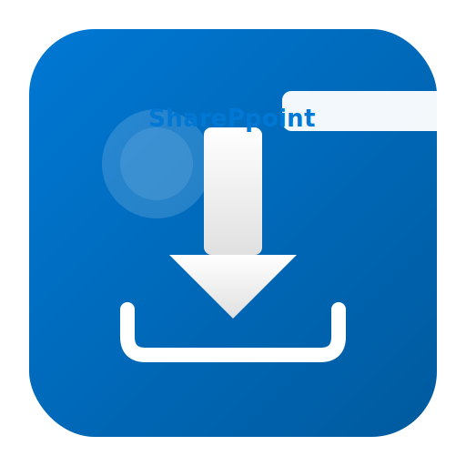

# sharepoint-dl

<p align="center">
  
</p>

<p align="center">
  <strong>Download videos and files from SharePoint — like yt-dlp for SharePoint.</strong>
</p>

<p align="center">
  <a href="https://github.com/bhayanak/sp-dl/actions/workflows/ci.yml"></a>
  <a href="https://codecov.io/gh/bhayanak/sp-dl"></a>
  <a href="https://pypi.org/project/sharepoint-dl/"></a>
  <a href="https://pypi.org/project/sharepoint-dl/"></a>
  <a href="LICENSE"></a>
</p>

---

## Why?

- Microsoft Stream (Classic) was retired — all videos now live in **SharePoint / OneDrive**
- Browser downloads fail for large files, offer no resume, and require clicking through menus
- **Enterprise tenants often block direct downloads** — `sp-dl` handles this automatically via adaptive streaming
- **yt-dlp** doesn't support SharePoint authentication
- `sp-dl` gives you **one command** to download any file from SharePoint

## What It Downloads

| Content | Source |
|---|---|
| Videos (.mp4, .mov, .webm) | SharePoint document libraries, Stream on SharePoint |
| Meeting recordings | OneDrive / SharePoint auto-saved recordings |
| Download-blocked videos | Enterprise tenants with admin download restrictions |
| Any file | SharePoint document libraries |
| Shared links | Anonymous or org-internal sharing links |

## Install

```bash
pip install sharepoint-dl
```

Or with [pipx](https://pipx.pypa.io/) for isolated install:

```bash
pipx install sharepoint-dl
```

## Quick Start

**First time?** Run `sp-dl quickstart` for a step-by-step guide.

### Using Cookies (Recommended — Easiest)

1. Log into SharePoint in your browser
2. Export cookies to a file using a browser extension like **"Get cookies.txt LOCALLY"**
3. Download:

```bash
sp-dl download "https://contoso.sharepoint.com/sites/Team/_layouts/15/stream.aspx?id=/sites/Team/Shared%20Documents/demo.mp4" \
  --cookies cookies.txt
```

### Auto-Extract Cookies from Browser

```bash
pip install 'sharepoint-dl[browser-cookies]'

# Close your browser first, then:
sp-dl download "https://contoso.sharepoint.com/sites/Team/Shared%20Documents/demo.mp4" \
  --cookies-from-browser chrome
```

### Using Device Code (OAuth — for enterprise tenants)

```bash
# One-time login (you'll be prompted for your org tenant)
sp-dl auth login --tenant contoso

# Download (uses saved token)
sp-dl download "https://contoso.sharepoint.com/sites/Team/Shared%20Documents/video.mp4"
```

### Download-Blocked Videos (Enterprise Tenants)

Some organizations disable direct file downloads via SharePoint admin policy. `sp-dl` detects this automatically and switches to **adaptive streaming** (DASH via ffmpeg):

```bash
# Works even when admin has blocked downloads!
# sp-dl detects the block → prompts OAuth2 login → streams via DASH manifest
sp-dl download "https://contoso-my.sharepoint.com/personal/user/_layouts/15/stream.aspx?id=..." \
  --cookies cookies.txt
```

**How it works:**
1. Detects `isDownloadBlocked` policy from the stream page
2. Acquires an OAuth2 token via device code flow (cached for future use)
3. Builds a DASH manifest URL via Microsoft's media proxy
4. Downloads all video segments using ffmpeg and merges them into a single MP4

> **Requires** [ffmpeg](https://ffmpeg.org/download.html) installed: `brew install ffmpeg` (macOS) or `apt install ffmpeg` (Linux)

## Usage

```bash
# Download a video
sp-dl download <URL> --cookies cookies.txt

# Download from a sharing link
sp-dl download "https://contoso.sharepoint.com/:v:/s/Team/EaBcDeFgHiJk" -c cookies.txt

# Auto-extract cookies from browser
sp-dl download <URL> --cookies-from-browser chrome

# Show file info without downloading
sp-dl download <URL> --info -c cookies.txt

# JSON metadata
sp-dl download <URL> --json -c cookies.txt

# Custom output path
sp-dl download <URL> -o ~/Videos/meeting.mp4 -c cookies.txt

# Output template
sp-dl download <URL> -o "%(site)s/%(folder)s/%(filename)s" -c cookies.txt

# Limit speed
sp-dl download <URL> --limit-rate 5M -c cookies.txt

# Skip existing files
sp-dl download <URL> --no-overwrites -c cookies.txt

# Batch download (one URL per line)
sp-dl batch urls.txt -c cookies.txt

# Quick start guide
sp-dl quickstart
```

## Supported URL Patterns

| Pattern | Example |
|---|---|
| Stream player | `https://tenant.sharepoint.com/sites/Team/_layouts/15/stream.aspx?id=...` |
| Sharing link | `https://tenant.sharepoint.com/:v:/s/Team/EncodedToken` |
| Direct path | `https://tenant.sharepoint.com/sites/Team/Shared%20Documents/file.mp4` |
| OneDrive | `https://tenant-my.sharepoint.com/personal/user/Documents/file.mp4` |
| Doc.aspx | `https://tenant.sharepoint.com/sites/Team/_layouts/15/Doc.aspx?sourcedoc={guid}` |

## Authentication Methods

| Method | Best For | Setup |
|---|---|---|
| `--cookies` | Quick downloads, read-only users | Export cookies from browser |
| `--cookies-from-browser` | Desktop users | Auto-extract from Chrome/Edge/Firefox |
| `sp-dl auth login` | Enterprise tenants, download-blocked sites | One-time device code login |
| `--client-id --client-secret` | Service accounts, CI/CD | Azure AD admin setup |

> **Enterprise users:** When direct downloads are blocked by admin policy, `sp-dl` automatically
> falls back to OAuth2 + adaptive streaming. Your first download will prompt for a device code login,
> and the token is cached for subsequent downloads.

## Auth Management

```bash
sp-dl auth login --tenant contoso       # Device code login (prompted for tenant)
sp-dl auth login --tenant contoso -i    # Browser-based login
sp-dl auth status                        # Check auth state
sp-dl auth logout                        # Clear tokens
```

> **Tip:** You can pass a SharePoint URL as the tenant and it will be auto-detected:
> `sp-dl auth login --tenant https://contoso.sharepoint.com`

## Output Templates

| Field | Description | Example |
|---|---|---|
| `%(filename)s` | Original filename | `training.mp4` |
| `%(title)s` | Name without extension | `training` |
| `%(ext)s` | Extension | `mp4` |
| `%(site)s` | SharePoint site | `Team` |
| `%(folder)s` | Parent folder | `Recordings` |
| `%(date)s` | Modified date | `20260415` |
| `%(author)s` | Created by | `John Smith` |

## Configuration

Create `~/.config/sp-dl/config.toml`:

```toml
[defaults]
output_template = "%(filename)s"
cookies_file = "/path/to/cookies.txt"
retries = 5
no_overwrites = false

[auth]
tenant = "contoso.onmicrosoft.com"
```

Environment variables: `SP_DL_COOKIES`, `SP_DL_TENANT`, `SP_DL_CLIENT_ID`, `SP_DL_OUTPUT`

## Development

```bash
git clone https://github.com/bhayanak/sp-dl.git
cd sp-dl
pip install -e ".[dev]"

# Run tests with coverage
pytest --cov=sp_dl -v

# Lint & format
ruff check src/ tests/
ruff format src/ tests/
```

## Architecture

```
sp-dl
├── auth/              # Authentication providers (cookies, OAuth2 device code, client creds)
├── resolver/          # URL → download target resolution
│   ├── sp_rest.py     # SharePoint REST API (v1 + v2.0)
│   ├── stream_page.py # stream.aspx HTML parsing + download-block detection
│   ├── media_stream.py# DASH manifest builder for download-blocked videos
│   ├── graph_api.py   # Microsoft Graph API
│   └── sharing.py     # Sharing link decoder
├── downloader/        # Download engines
│   ├── engine.py      # HTTP download with resume + retry
│   └── ffmpeg.py      # Adaptive streaming (DASH/HLS) via ffmpeg
├── url_parser/        # URL type detection and parsing
├── cli.py             # Typer CLI application
└── config.py          # TOML config + env var loading
```

## License

[MIT](LICENSE)
